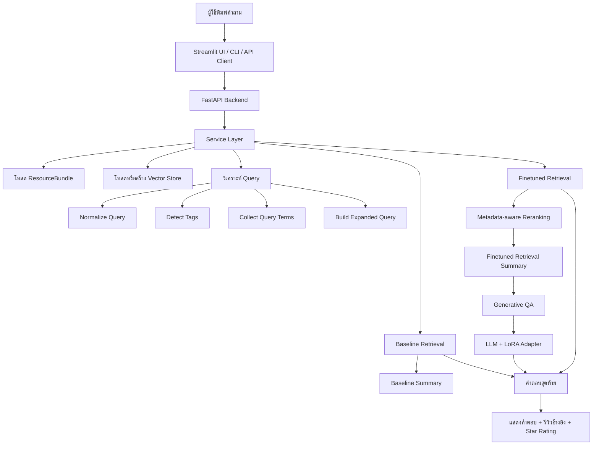
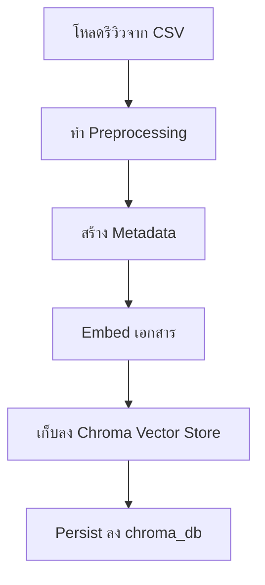
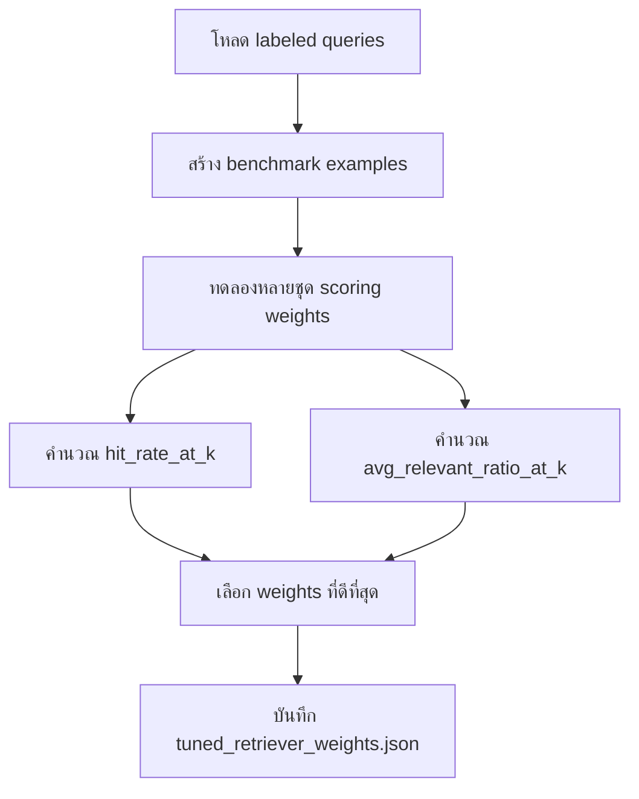
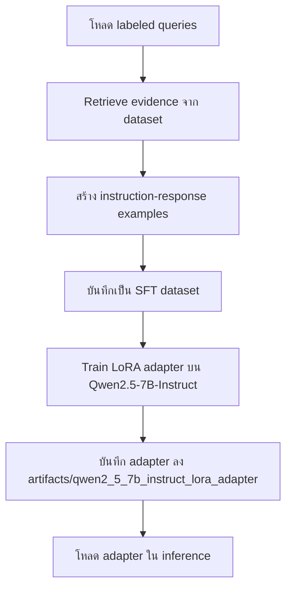

# รายงานสรุปแนวคิดและกระบวนการทำงานของระบบ Wongnai Restaurant QA

## 1. บทนำและเป้าหมายของงาน

โปรเจกต์นี้พัฒนาระบบถามตอบเกี่ยวกับอาหารและร้านอาหารจากข้อมูลรีวิว Wongnai โดยใช้ข้อมูลหลักจาก `wongnai-review-dataset` และ resource เสริมที่โจทย์ระบุ ได้แก่ `food_dictionary.txt`, `labeled_queries_by_algo.txt` และ `labeled_queries_by_judges.txt`

เป้าหมายของระบบคือรับคำถามภาษาธรรมชาติจากผู้ใช้ แล้วตอบกลับเป็นคำแนะนำร้านหรือสรุปข้อมูลที่เกี่ยวข้อง โดยอ้างอิงจากรีวิวจริงใน dataset ไม่ใช่การตอบแบบเดาสุ่มจากความรู้ทั่วไปของโมเดลเพียงอย่างเดียว

ระบบนี้ออกแบบให้ครอบคลุมคำถามอย่างน้อย 5 กลุ่มตามโจทย์:

1. คำถามเกี่ยวกับสัญชาติอาหาร เช่น ไทย จีน ญี่ปุ่น อินเดีย อิตาลี ฟิวชัน
2. คำถามเกี่ยวกับประเภทอาหาร เช่น อาหารทะเล พิซซ่า เบเกอรี่ ของหวาน เครื่องดื่ม ก๋วยเตี๋ยว อาหารสุขภาพ
3. คำถามเกี่ยวกับบรรยากาศร้านและราคา เช่น หรูหรา ติดแอร์ ข้างทาง ราคาย่อมเยา ราคาแพง
4. คำถามเกี่ยวกับสถานที่ตั้ง เช่น พัทยา เชียงใหม่ ติดทะเล บนเขา บรรยากาศสงบ
5. คำถามแบบผสมหลายเงื่อนไข เช่น อาหารทะเลแบบไทย ๆ ติดชายหาดแถวพัทยา

นอกจากการตอบคำถามให้ใช้งานได้จริงแล้ว งานนี้ยังต้องแสดงให้เห็นองค์ประกอบสำคัญของระบบ NLP ครบถ้วน ได้แก่

- การเตรียมข้อมูล
- การเลือก pretrained model
- การออกแบบ retrieval
- การใช้ generative QA
- การเปรียบเทียบ baseline กับ finetuned model
- การประเมินผล
- การแสดงผลลัพธ์ผ่าน CLI, API หรือหน้าเว็บ

## 2. แนวคิดหลักของระบบ

แนวคิดหลักของโปรเจกต์นี้คือใช้สถาปัตยกรรมแบบ RAG (Retrieval-Augmented Generation)

หลักการคือ:

1. รับคำถามจากผู้ใช้
2. วิเคราะห์ว่าคำถามกล่าวถึงอาหารประเภทใด สัญชาติอะไร ราคาแบบไหน หรือสถานที่ใด
3. ไปค้นรีวิวที่เกี่ยวข้องจาก dataset
4. จัดอันดับรีวิวที่เกี่ยวข้องมากที่สุด
5. สรุปผลใน 2 ระดับ
   - ระดับ retrieval summary เพื่อใช้เป็น baseline และเทียบผล retrieval
   - ระดับ generative QA โดยส่งรีวิวที่ค้นได้เข้า LLM เพื่อสร้างคำตอบที่อ่านง่ายขึ้น

เหตุผลที่ไม่ใช้ LLM ตอบโดยตรงโดยไม่ retrieve รีวิวก่อน เพราะโจทย์กำหนดให้ตอบจากข้อมูล Wongnai review dataset และต้องสามารถอ้างอิงรีวิวรวมถึง star rating ได้ การใช้ retrieval ก่อนจะช่วยให้คำตอบ grounded กับข้อมูลจริงในชุดข้อมูลมากขึ้น

## 3. เหตุผลที่เลือกทำระบบแบบนี้

เหตุผลเชิงวิศวกรรมและเชิงโจทย์มีดังนี้

- Dataset เป็นข้อมูลรีวิวจริงที่กระจายตัวสูงและมีภาษาธรรมชาติหลากหลาย จึงเหมาะกับการทำ semantic retrieval มากกว่าการ match keyword อย่างเดียว
- คำถามของผู้ใช้มักเป็นคำถามผสม เช่น “ร้านอาหารทะเลแบบไทย ๆ ติดทะเลแถวพัทยา” ซึ่งต้องใช้ทั้งความหมายเชิง semantic และ metadata-aware reranking
- คำตอบที่ดีไม่ควรแค่คืนรีวิวดิบ แต่ควรสรุปเป็นภาษามนุษย์อ่านง่าย จึงต้องมี generative QA
- งานต้องแสดง baseline และ finetuned เปรียบเทียบกัน จึงแยกชัดเจนเป็น baseline retrieval กับ finetuned retriever/reranker และเพิ่ม LLM fine-tuning ด้วย LoRA เพื่อให้ส่วน generation ตรงโดเมนมากขึ้น

## 4. ข้อมูลที่ใช้ในโปรเจกต์

ข้อมูลที่ใช้มี 4 กลุ่มหลัก

### 4.1 รีวิวหลัก

- `review_dataset/w_review_train.csv`

ไฟล์นี้เป็นแหล่งข้อมูลรีวิวร้านอาหารหลักของระบบ ใช้สร้าง index สำหรับ retrieval และใช้เป็น evidence ตอนสร้างคำตอบ

### 4.2 พจนานุกรมคำอาหาร

- `review_dataset/food_dictionary.txt`

ไฟล์นี้ใช้เป็นฐานคำศัพท์เชิงโดเมน เช่น คำเรียกอาหาร ประเภทอาหาร สัญชาติอาหาร หรือคำที่เกี่ยวข้องกับร้านอาหาร ช่วยให้ระบบตรวจจับ signal ในคำถามได้ดีขึ้น

### 4.3 Query labels จาก algorithm

- `review_dataset/labeled_queries_by_algo.txt`

ใช้เป็นข้อมูล label กึ่งอัตโนมัติสำหรับสร้าง benchmark, tuning retriever และสร้าง supervised fine-tuning examples

### 4.4 Query labels จาก judges

- `review_dataset/labeled_queries_by_judges.txt`

ใช้เป็น label ที่มีคุณภาพสูงกว่าฝั่ง algorithm ในการประเมินและช่วยสร้างตัวอย่างสำหรับ tuning/fine-tuning

## 5. การเตรียมข้อมูล (Data Preprocessing)

การเตรียมข้อมูลเป็นหัวใจของงานนี้ เพราะคุณภาพของ retrieval และ generation ขึ้นกับความสะอาดและโครงสร้างของข้อมูลอย่างมาก

งาน preprocessing หลักอยู่ใน [wongnai_qa/preprocessing.py](/abs/path/c:/Users/com/Desktop/NLP/wongnai_qa/preprocessing.py)

### 5.1 ขั้นตอน preprocessing รีวิว

ระบบทำขั้นตอนหลักดังนี้

1. อ่านข้อมูลรีวิวจากไฟล์ CSV
2. คัดกรอง record ที่ไม่มีข้อความรีวิวหรือมีค่าที่ใช้ไม่ได้
3. ทำ normalization ข้อความ เช่น จัดการช่องว่างและฟอร์แมตข้อความ
4. แยกรีวิวเป็นหน่วยเอกสารที่ใช้ใน retrieval
5. สร้าง metadata เชิงโดเมนแนบไปกับแต่ละเอกสาร

### 5.2 Metadata ที่สร้าง

เอกสารแต่ละชิ้นจะมี metadata เพื่อช่วย retrieval และ reranking เช่น

- `rating`
- `cuisine`
- `food_type`
- `ambience`
- `price`
- `location`
- `known_terms`

เหตุผลที่ต้องสร้าง metadata เพราะคำถามของผู้ใช้จำนวนมากไม่ได้ถามจากข้อความรีวิวล้วน ๆ แต่ถามแบบมีเงื่อนไข เช่น ราคาถูก บรรยากาศดี ติดทะเล หรืออาหารญี่ปุ่น ซึ่ง metadata ช่วยให้ระบบ match เงื่อนไขเหล่านี้ได้แม่นขึ้น

### 5.3 Resource bundle สำหรับวิเคราะห์คำถาม

ระบบรวมข้อมูลจาก `food_dictionary.txt`, query labels และชุด tag groups ภายในระบบเพื่อสร้าง resource bundle สำหรับใช้วิเคราะห์ query

สิ่งที่ resource bundle ช่วยได้คือ

- แยก category ของคำถาม
- ตรวจจับคำเกี่ยวกับอาหาร สถานที่ ราคา และบรรยากาศ
- ขยาย query ให้ครอบคลุมคำที่เกี่ยวข้อง
- เพิ่ม signal สำหรับ scoring ใน retrieval

## 6. การวิเคราะห์คำถามของผู้ใช้

ก่อนค้นรีวิว ระบบจะวิเคราะห์ query ก่อนเสมอ โดย logic หลักอยู่ใน [wongnai_qa/preprocessing.py](/abs/path/c:/Users/com/Desktop/NLP/wongnai_qa/preprocessing.py)

ผลลัพธ์จากการวิเคราะห์ query ประกอบด้วย

- ข้อความ query ที่ normalize แล้ว
- expanded query
- detected tags แยกเป็นกลุ่ม เช่น cuisine, food_type, ambience, price, location
- query terms ที่สำคัญ
- known terms ที่พบจาก dictionary

ทำไปทำไม:

- เพื่อให้ retrieval ไม่พึ่ง embedding อย่างเดียว
- เพื่อเพิ่มความสามารถกับคำถามผสมหลายเงื่อนไข
- เพื่อรองรับคำถามภาษาไทยที่มีรูปแบบหลากหลาย

## 7. การเลือกโมเดล

### 7.1 Embedding model

ใช้ `intfloat/multilingual-e5-large`

เหตุผล:

- รองรับหลายภาษา
- ใช้กับภาษาไทยและภาษาอังกฤษได้
- เหมาะกับ semantic retrieval
- เป็น pretrained model ที่ทันสมัยพอสำหรับงาน retrieval

### 7.2 Generation model

ใช้ `Qwen/Qwen2.5-7B-Instruct`

เหตุผล:

- รองรับการตอบภาษาไทยได้ดี
- เหมาะกับงานสรุปคำตอบจาก context
- สามารถต่อยอดด้วย LoRA fine-tuning ได้

## 8. Retrieval pipeline

งาน retrieval อยู่ใน [wongnai_qa/retrieval.py](/abs/path/c:/Users/com/Desktop/NLP/wongnai_qa/retrieval.py)

ระบบ retrieval แบ่งออกเป็น 2 แบบ

### 8.1 Baseline retrieval

baseline ใช้แนวคิดตรงไปตรงมา:

1. แปลง query เป็น embedding
2. ค้นเอกสารจาก vector store ด้วย similarity search
3. นำผลลัพธ์ที่ได้มาสรุปเป็น baseline answer

ลักษณะของ baseline:

- พึ่ง semantic similarity เป็นหลัก
- ไม่มี metadata-aware reranking ที่ซับซ้อน
- ใช้เป็นตัวเปรียบเทียบกับ finetuned retriever

### 8.2 Finetuned retrieval

finetuned retrieval ในโปรเจกต์นี้หมายถึง retriever/reranker ที่ปรับน้ำหนัก scoring ให้เข้ากับโดเมน Wongnai มากขึ้น

แนวคิดคือ:

1. ดึง candidate documents จาก vector search
2. วิเคราะห์ query ว่าต้องการ signal อะไรบ้าง
3. คำนวณคะแนนใหม่จากหลายองค์ประกอบ
4. จัดอันดับเอกสารใหม่ก่อนส่งต่อให้ generation

องค์ประกอบของ scoring function มีอย่างน้อย:

- semantic retrieval score
- tag match score
- keyword match score
- rating signal
- exact phrase signal

ผลของแนวทางนี้คือรีวิวที่ได้ไม่ใช่แค่ “คล้ายความหมาย” แต่ยัง “ตรงเงื่อนไขโดเมน” มากขึ้น เช่น ถามหาร้านติดทะเล ราคาย่อมเยา และอาหารทะเลพร้อมกัน

### 8.3 Vector store

ระบบใช้ persistent vector store ใน [chroma_db](/abs/path/c:/Users/com/Desktop/NLP/chroma_db)

ทำไปทำไม:

- ไม่ต้อง embed รีวิวใหม่ทุกครั้งที่เปิดระบบ
- ลดเวลารันหลังจากสร้าง index ครั้งแรก
- ใช้ซ้ำได้ทั้ง CLI, API และ Streamlit

## 9. Baseline model และ Finetuned model

โจทย์กำหนดให้เปรียบเทียบ baseline model กับ finetuned model

ในโปรเจกต์นี้นิยามดังนี้

### 9.1 Baseline model

- Pure vector retrieval
- ไม่มี domain-specific reranking ที่ซับซ้อน
- สรุปคำตอบจากเอกสารที่ retrieve ได้แบบง่าย

### 9.2 Finetuned model

โปรเจกต์นี้มีการ fine-tune อยู่ 2 ระดับ

1. `Finetuned retriever/reranker`
   - ปรับ scoring weights ของ retrieval จาก labeled queries
   - ทำให้ retrieval เข้ากับโจทย์ร้านอาหารมากขึ้น

2. `Fine-tuned LLM ด้วย LoRA`
   - ปรับ LLM ให้ตอบในสไตล์งานนี้ได้ดีขึ้น
   - ใช้ query/evidence ที่สร้างจาก dataset ของงาน

ดังนั้นถ้าพูดให้ชัด:

- baseline = baseline retrieval
- finetuned = finetuned retriever + LoRA-tuned LLM ในฝั่ง generation

## 10. การ tune retriever

งาน tune retriever อยู่ใน [wongnai_qa/evaluation.py](/abs/path/c:/Users/com/Desktop/NLP/wongnai_qa/evaluation.py) และสคริปต์ [scripts/tune_retriever.py](/abs/path/c:/Users/com/Desktop/NLP/scripts/tune_retriever.py)

### 10.1 ทำอะไร

ระบบสร้าง benchmark จาก labeled queries แล้วทดลองปรับน้ำหนักของ scoring function เพื่อหาชุดน้ำหนักที่ให้ผล retrieval ดีขึ้น

น้ำหนักที่ tune ได้แก่

- rating weight
- tag weight
- keyword weight
- exact phrase weight

### 10.2 ทำไปทำไม

เพราะ vector similarity อย่างเดียวอาจดึงรีวิวที่ “ใกล้เคียง” แต่ไม่ “ตรงโจทย์” พอ โดยเฉพาะคำถามหลายเงื่อนไข การปรับ scoring weights ทำให้ระบบคำนึงถึง signal จาก metadata และคำสำคัญได้ดีขึ้น

### 10.3 ผลลัพธ์ของการ tune

น้ำหนักที่บันทึกไว้ใน [artifacts/tuned_retriever_weights.json](/abs/path/c:/Users/com/Desktop/NLP/artifacts/tuned_retriever_weights.json) คือ

- `rating = 0.05`
- `tag = 0.45`
- `keyword = 0.33`
- `exact = 0.0`

จุดนี้สะท้อนว่าระบบพึ่ง tag และ keyword มากกว่าการ match แบบ exact phrase ในชุดทดลองที่ใช้

## 11. Generative QA

งาน generation อยู่ใน [wongnai_qa/generation.py](/abs/path/c:/Users/com/Desktop/NLP/wongnai_qa/generation.py)

ระบบมีการสรุปคำตอบ 2 ระดับ

### 11.1 Retrieval summary

เป็นการสรุปจากเอกสารที่ retrieve ได้โดยไม่เรียก LLM มากนัก ใช้สำหรับ:

- แสดง baseline answer
- แสดง finetuned retrieval answer
- ใช้เปรียบเทียบผล retrieval โดยตรง

### 11.2 Generative answer

เมื่อ `include_improved=True` ระบบจะส่งรีวิวที่ retrieve ได้เข้า LLM เพื่อสร้างคำตอบภาษาไทยที่อ่านง่ายขึ้น

prompt ถูกออกแบบให้:

- อ้างอิงจาก evidence เท่านั้น
- ระบุ star rating ถ้ามี
- ถ้ามีหลายร้านให้แยกเป็นรายการ
- หลีกเลี่ยงการแต่งชื่อร้านหรือข้อมูลที่ไม่มีในรีวิว

## 12. การ fine-tune LLM ด้วย LoRA

งานนี้มีการ fine-tune LLM จริงด้วย LoRA/QLoRA โดยใช้โค้ดใน [wongnai_qa/finetuning.py](/abs/path/c:/Users/com/Desktop/NLP/wongnai_qa/finetuning.py)

สคริปต์ที่เกี่ยวข้องคือ

- [scripts/build_llm_sft_dataset.py](/abs/path/c:/Users/com/Desktop/NLP/scripts/build_llm_sft_dataset.py)
- [scripts/train_llm_lora.py](/abs/path/c:/Users/com/Desktop/NLP/scripts/train_llm_lora.py)

### 12.1 ทำอะไร

1. สร้าง SFT dataset จาก query labels และ evidence ที่ retrieve ได้
2. แปลงให้อยู่ในรูป instruction-response
3. train LoRA adapter บน `Qwen/Qwen2.5-7B-Instruct`
4. โหลด adapter กลับมาใช้ใน inference

### 12.2 ทำไปทำไม

LoRA fine-tuning ช่วยให้ LLM:

- ตอบในโดเมนร้านอาหารได้ตรงขึ้น
- จัดรูปแบบคำตอบได้สม่ำเสมอขึ้น
- อ้างอิง evidence ได้ดีขึ้น
- ตอบภาษาไทยเชิงงานนี้ได้ดีขึ้นโดยไม่ต้อง fine-tune ทั้งโมเดล

### 12.3 ข้อดีของ LoRA

- ใช้ทรัพยากรน้อยกว่า full fine-tuning
- train ได้บน GPU ของผู้พัฒนา
- เก็บเป็น adapter แยกจาก base model
- เปรียบเทียบก่อนและหลัง fine-tune ได้ง่าย

### 12.4 Artifact ที่ได้

- SFT dataset: [artifacts/llm_sft_dataset.jsonl](/abs/path/c:/Users/com/Desktop/NLP/artifacts/llm_sft_dataset.jsonl)
- LoRA adapter: [artifacts/qwen2_5_7b_instruct_lora_adapter](/abs/path/c:/Users/com/Desktop/NLP/artifacts/qwen2_5_7b_instruct_lora_adapter)

ระบบ inference ใน [wongnai_qa/llm.py](/abs/path/c:/Users/com/Desktop/NLP/wongnai_qa/llm.py) จะพยายามโหลด adapter นี้อัตโนมัติถ้ามีอยู่

## 13. ชั้น orchestration ของระบบ

งาน orchestration หลักอยู่ใน [wongnai_qa/service.py](/abs/path/c:/Users/com/Desktop/NLP/wongnai_qa/service.py)

ไฟล์นี้ทำหน้าที่เป็นแกนกลางของระบบ โดยเชื่อมส่วนต่าง ๆ เข้าด้วยกัน

ลำดับงานหลักใน service:

1. โหลดหรือเตรียม vector store
2. วิเคราะห์ query
3. รัน baseline retrieval
4. รัน finetuned retrieval
5. สร้าง baseline answer
6. สร้าง finetuned retrieval answer
7. ถ้าเปิด generation ให้เรียก LLM เพื่อสร้าง improved answer
8. serialize เอกสารที่ retrieve ได้เพื่อส่งออกไปยัง API/CLI/UI

ข้อดีของการมี service layer กลางคือ logic หลักไม่กระจายซ้ำในหลาย entrypoint

## 14. API, UI และช่องทางแสดงผล

### 14.1 FastAPI backend

[wongnai_qa/api.py](/abs/path/c:/Users/com/Desktop/NLP/wongnai_qa/api.py)

หน้าที่:

- รับ query จาก frontend หรือ client
- เรียก service layer
- คืนผลเป็น JSON ที่มีทั้ง baseline, finetuned, improved answer และ retrieved documents

### 14.2 Streamlit UI

[wongnai_qa/ui.py](/abs/path/c:/Users/com/Desktop/NLP/wongnai_qa/ui.py)

หน้าที่:

- รับคำถามจากผู้ใช้
- ส่งคำถามไป backend
- แสดงผล baseline เทียบกับ finetuned
- แสดงคำตอบสรุปจาก LLM
- แสดงรีวิวอ้างอิงพร้อม star rating

### 14.3 CLI

ผ่าน [main.py](/abs/path/c:/Users/com/Desktop/NLP/main.py) และ [wongnai_qa/cli.py](/abs/path/c:/Users/com/Desktop/NLP/wongnai_qa/cli.py)

หน้าที่:

- ใช้ทดสอบ query จาก command line
- เหมาะกับการเดโมหรือ debug โดยไม่ต้องเปิดเว็บ

## 15. Workflow schema ของระบบ

### 15.1 Workflow ภาพรวม

#### Mermaid Diagram



#### ASCII Diagram

```text
ผู้ใช้พิมพ์คำถาม
        |
        v
Streamlit UI / CLI / API Client
        |
        v
FastAPI Backend
        |
        v
Service Layer
        |
        +--> โหลด ResourceBundle และ Vector Store
        |
        +--> วิเคราะห์ Query
        |      - normalize query
        |      - detect tags
        |      - collect query terms
        |      - build expanded query
        |
        +--> Baseline Retrieval
        |      - embedding similarity search
        |
        +--> Finetuned Retrieval
        |      - similarity search
        |      - metadata-aware scoring
        |      - reranking
        |
        +--> Baseline Summary
        |
        +--> Finetuned Retrieval Summary
        |
        +--> Generative QA
               - ส่ง evidence เข้า LLM
               - ใช้ LoRA adapter ถ้ามี
        |
        v
ส่งคำตอบกลับ
        |
        v
แสดงคำตอบ + รีวิวอ้างอิง + star rating
```

### 15.2 Workflow การสร้าง index

#### Mermaid Diagram



#### ASCII Diagram

```text
โหลดรีวิวจาก CSV
    |
    v
ทำ preprocessing
    |
    v
สร้าง metadata ของแต่ละเอกสาร
    |
    v
embed เอกสาร
    |
    v
เก็บลง Chroma vector store
    |
    v
persist ลง chroma_db
```

### 15.3 Workflow การ tune retriever

#### Mermaid Diagram



#### ASCII Diagram

```text
โหลด labeled queries
    |
    v
สร้าง benchmark examples
    |
    v
ลองชุด scoring weights หลายแบบ
    |
    v
วัด hit_rate_at_k และ avg_relevant_ratio_at_k
    |
    v
เลือกน้ำหนักที่ดีที่สุด
    |
    v
บันทึกลง artifacts/tuned_retriever_weights.json
```

### 15.4 Workflow การ fine-tune LLM

#### Mermaid Diagram



#### ASCII Diagram

```text
โหลด labeled queries
    |
    v
retrieve evidence จาก dataset
    |
    v
สร้าง instruction-response examples
    |
    v
บันทึกเป็น SFT dataset
    |
    v
train LoRA adapter บน Qwen2.5-7B-Instruct
    |
    v
บันทึก adapter ลง artifacts/qwen2_5_7b_instruct_lora_adapter
    |
    v
โหลด adapter ใน inference
```

## 16. ไฟล์สำคัญและหน้าที่ของแต่ละไฟล์

### 16.1 Package หลัก

- [wongnai_qa/config.py](/abs/path/c:/Users/com/Desktop/NLP/wongnai_qa/config.py): ค่าตั้งต้นของระบบ path model path artifacts และชุดคำถามตัวอย่าง
- [wongnai_qa/preprocessing.py](/abs/path/c:/Users/com/Desktop/NLP/wongnai_qa/preprocessing.py): โหลดข้อมูลรีวิว สร้าง resource bundle เตรียม metadata และวิเคราะห์ query
- [wongnai_qa/retrieval.py](/abs/path/c:/Users/com/Desktop/NLP/wongnai_qa/retrieval.py): embeddings, vector store, baseline retrieval, finetuned retrieval และ scoring weights
- [wongnai_qa/generation.py](/abs/path/c:/Users/com/Desktop/NLP/wongnai_qa/generation.py): สร้าง baseline summary และ prompt สำหรับ generative QA
- [wongnai_qa/llm.py](/abs/path/c:/Users/com/Desktop/NLP/wongnai_qa/llm.py): โหลด base model และ LoRA adapter สำหรับ inference
- [wongnai_qa/service.py](/abs/path/c:/Users/com/Desktop/NLP/wongnai_qa/service.py): orchestration layer หลักของระบบ
- [wongnai_qa/api.py](/abs/path/c:/Users/com/Desktop/NLP/wongnai_qa/api.py): FastAPI backend
- [wongnai_qa/ui.py](/abs/path/c:/Users/com/Desktop/NLP/wongnai_qa/ui.py): logic ของ Streamlit UI
- [wongnai_qa/evaluation.py](/abs/path/c:/Users/com/Desktop/NLP/wongnai_qa/evaluation.py): benchmark, tuning และ evaluation
- [wongnai_qa/finetuning.py](/abs/path/c:/Users/com/Desktop/NLP/wongnai_qa/finetuning.py): สร้าง SFT dataset และ train LoRA adapter

### 16.2 Scripts

- [scripts/tune_retriever.py](/abs/path/c:/Users/com/Desktop/NLP/scripts/tune_retriever.py): tune น้ำหนักของ finetuned retriever
- [scripts/evaluate_models.py](/abs/path/c:/Users/com/Desktop/NLP/scripts/evaluate_models.py): วัดผล baseline เทียบ finetuned
- [scripts/run_assignment_demo.py](/abs/path/c:/Users/com/Desktop/NLP/scripts/run_assignment_demo.py): รัน query ตัวอย่างครบ 5 หมวดตามโจทย์
- [scripts/build_llm_sft_dataset.py](/abs/path/c:/Users/com/Desktop/NLP/scripts/build_llm_sft_dataset.py): สร้าง supervised fine-tuning dataset สำหรับ LLM
- [scripts/train_llm_lora.py](/abs/path/c:/Users/com/Desktop/NLP/scripts/train_llm_lora.py): train LoRA adapter สำหรับ Qwen2.5-7B-Instruct

## 17. การประเมินผล (Evaluation)

งานประเมินผลอยู่ใน [wongnai_qa/evaluation.py](/abs/path/c:/Users/com/Desktop/NLP/wongnai_qa/evaluation.py) และสคริปต์ [scripts/evaluate_models.py](/abs/path/c:/Users/com/Desktop/NLP/scripts/evaluate_models.py)

### 17.1 Metric ที่ใช้

อย่างน้อยใช้ metric ดังนี้

- `hit_rate_at_k`
- `avg_relevant_ratio_at_k`

### 17.2 นิยาม relevance

ในโปรเจกต์นี้ relevance นิยามแบบ pseudo-label โดยอิงจาก

- metadata tags ที่ตรงกับ query
- query terms ที่ match กับเอกสาร
- known terms และ domain signals ที่สอดคล้องกัน

### 17.3 ทำไปทำไม

เพราะ dataset ไม่ได้มี gold relevance labels ครบทุก query จึงต้องใช้แนวทางประเมินแบบ heuristic/pseudo-supervision เพื่อให้สามารถเปรียบเทียบ baseline กับ finetuned ได้ในเชิงระบบ

## 18. ผลการทดลองที่มีในโปรเจกต์ปัจจุบัน

artifact ที่มีอยู่แล้วในโปรเจกต์:

- [artifacts/tuned_retriever_weights.json](/abs/path/c:/Users/com/Desktop/NLP/artifacts/tuned_retriever_weights.json)
- [artifacts/tune_result.json](/abs/path/c:/Users/com/Desktop/NLP/artifacts/tune_result.json)
- [artifacts/eval_result.json](/abs/path/c:/Users/com/Desktop/NLP/artifacts/eval_result.json)
- [artifacts/assignment_demo.json](/abs/path/c:/Users/com/Desktop/NLP/artifacts/assignment_demo.json)
- [artifacts/llm_sft_dataset.jsonl](/abs/path/c:/Users/com/Desktop/NLP/artifacts/llm_sft_dataset.jsonl)
- [artifacts/qwen2_5_7b_instruct_lora_adapter](/abs/path/c:/Users/com/Desktop/NLP/artifacts/qwen2_5_7b_instruct_lora_adapter)

ผลที่ได้ในรอบทดลองที่มีการบันทึกไว้:

- สามารถ tune retriever และบันทึก weights ได้จริง
- สามารถ evaluate baseline เทียบ finetuned ได้จริง
- สามารถรัน demo query ครบ 5 หมวดตามโจทย์ได้จริง
- สามารถสร้าง SFT dataset ได้จริง
- สามารถ train LoRA adapter บน GPU ได้จริง
- สามารถโหลด adapter กลับมาใช้ใน inference ได้จริง

## 19. วิธีใช้งานระบบ

### 19.1 รัน backend

```powershell
uv run uvicorn main:app --host 127.0.0.1 --port 8001
```

### 19.2 รัน Streamlit

```powershell
uv run streamlit run streamlit_app.py
```

### 19.3 รันผ่าน CLI

```powershell
uv run python main.py --query "อาหารทะเลแบบไทยๆ ติดชายหาดแถวพัทยา"
```

### 19.4 Tune retriever

```powershell
uv run python scripts/tune_retriever.py
```

### 19.5 Evaluate baseline vs finetuned

```powershell
uv run python scripts/evaluate_models.py
```

### 19.6 รันชุด query ครบ 5 หมวด

```powershell
uv run python scripts/run_assignment_demo.py
```

### 19.7 สร้าง SFT dataset

```powershell
uv run python scripts/build_llm_sft_dataset.py
```

### 19.8 Train LoRA adapter

```powershell
uv run python scripts/train_llm_lora.py
```

## 20. ข้อดีของระบบที่พัฒนา

- ใช้ dataset ตามโจทย์จริง
- ใช้ทั้ง review data, food dictionary และ labeled queries
- รองรับ retrieval และ generative QA
- เปรียบเทียบ baseline กับ finetuned ได้
- แสดง star rating ในผลลัพธ์
- มี pipeline tuning, evaluation และ fine-tuning
- มีช่องทางใช้งานทั้ง CLI, API และ Streamlit
- มี artifacts และผลรันจริงรองรับ

## 21. ข้อจำกัดของระบบ

- คุณภาพ retrieval และ generation ยังขึ้นกับคุณภาพ metadata และ query labels
- evaluation ปัจจุบันยังอาศัย pseudo-label เป็นหลัก
- การรัน generative QA แบบ local ใช้เวลาพอสมควร โดยเฉพาะเมื่อเปิด LLM พร้อม LoRA adapter
- หากย้ายไปเครื่องใหม่ที่ไม่มี model cache หรือ artifacts อาจต้องดาวน์โหลดหรือสร้างใหม่บางส่วน
- ถ้าข้อมูลรีวิวไม่มีชื่อร้านชัดเจน คำตอบอาจอ้างอิงเป็นลักษณะ “ตัวเลือก” มากกว่าชื่อร้านเฉพาะ

## 22. สรุป

โปรเจกต์นี้พัฒนาระบบถามตอบเกี่ยวกับอาหารและร้านอาหารจากข้อมูล Wongnai review dataset โดยใช้แนวทาง RAG เป็นแกนหลัก ผสมทั้ง semantic retrieval, metadata-aware reranking, abstractive generation และ LoRA fine-tuning ของ LLM

สิ่งที่ทำในงานนี้ไม่ใช่เพียงการค้นรีวิวแล้วแสดงผล แต่เป็นการสร้าง pipeline เต็มรูปแบบตั้งแต่ preprocessing, query understanding, retrieval, reranking, summarization, evaluation, retriever tuning และ LLM fine-tuning พร้อมเอกสารและ artifact ที่ใช้งานได้จริง

ในเชิงโจทย์ งานนี้ครอบคลุมทั้ง 5 หมวดคำถามหลัก แสดง baseline เทียบกับ finetuned model ได้ มีการระบุ star rating ในผลลัพธ์ มีรายงานอธิบายการทำงาน และมีช่องทางสาธิตการทำงานจริงผ่าน Streamlit, FastAPI และ CLI
