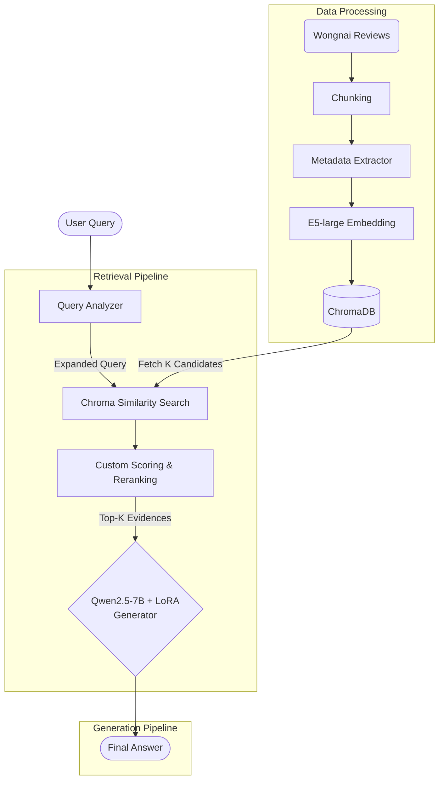

# รายงานเชิงวิชาการ: ระบบถามตอบและแนะนำร้านอาหารจากข้อมูลรีวิว Wongnai ด้วย Retrieval-Augmented Generation

## 1. บทนำ

งานวิจัยนี้มีวัตถุประสงค์เพื่อพัฒนาระบบถามตอบเกี่ยวกับอาหารและร้านอาหารโดยใช้ข้อมูลรีวิวจากชุดข้อมูล Wongnai เป็นแหล่งความรู้หลัก ระบบถูกออกแบบให้รองรับคำถามที่เกี่ยวข้องกับสัญชาติอาหาร ประเภทอาหาร บรรยากาศและราคา สถานที่ตั้ง และคำถามแบบผสมหลายเงื่อนไข โดยคำตอบต้องอ้างอิงจากหลักฐานจริงในชุดข้อมูล ไม่ใช่การตอบจากความรู้ทั่วไปของโมเดลเพียงอย่างเดียว

สถาปัตยกรรมของระบบใช้แนวคิด Retrieval-Augmented Generation (RAG) ซึ่งแบ่งงานออกเป็น 2 ส่วนหลัก ได้แก่ retrieval สำหรับค้นคืนรีวิวที่เกี่ยวข้อง และ generation สำหรับสรุปคำตอบให้เป็นภาษาธรรมชาติที่อ่านเข้าใจง่าย นอกจากนี้ยังมีการเปรียบเทียบผลระหว่าง baseline model กับ finetuned model เพื่อศึกษาว่า query understanding และ reranking ที่ปรับแต่งเชิงโดเมนช่วยเพิ่มคุณภาพการตอบคำถามได้มากน้อยเพียงใด

## 2. วัตถุประสงค์ของงาน

1. พัฒนาระบบถามตอบที่สามารถใช้ข้อมูลจาก `wongnai-review-dataset` ในการตอบคำถามเกี่ยวกับอาหารและร้านอาหารได้จริง
2. รองรับคำถามอย่างน้อย 5 กลุ่ม ได้แก่ สัญชาติอาหาร ประเภทอาหาร บรรยากาศ/ราคา สถานที่ตั้ง และคำถามแบบผสม
3. เปรียบเทียบผลการทำงานระหว่าง baseline retrieval กับ finetuned retrieval
4. ใช้ pretrained model ที่รองรับภาษาไทยและภาษาอังกฤษ
5. แสดงผลการแนะนำร้านพร้อม star rating และหลักฐานจากรีวิว

## 3. ชุดข้อมูลที่ใช้

ชุดข้อมูลและทรัพยากรที่ใช้ในงานนี้ประกอบด้วย 4 ส่วนหลัก

### 3.1 รีวิวหลัก

- `review_dataset/w_review_train.csv`

ไฟล์นี้เป็นแหล่งข้อมูลรีวิวร้านอาหารหลัก ใช้สร้างดัชนีเอกสารสำหรับ retrieval และใช้เป็น evidence ในขั้นสรุปคำตอบ

### 3.2 พจนานุกรมคำศัพท์อาหาร

- `review_dataset/food_dictionary.txt`

ใช้เป็นแหล่งคำศัพท์เชิงโดเมนสำหรับดึงคำสำคัญจาก query และ review เช่น ชื่ออาหาร ประเภทอาหาร และคำที่เกี่ยวข้องกับการแนะนำร้านอาหาร

### 3.3 Query labels จากอัลกอริทึม

- `review_dataset/labeled_queries_by_algo.txt`

ใช้เป็นข้อมูลเสริมสำหรับสร้าง benchmark, ดึง frequent query terms และ tuning retriever

### 3.4 Query labels จากผู้ประเมิน

- `review_dataset/labeled_queries_by_judges.txt`

ใช้เป็น query labels ที่มีคุณภาพสูงขึ้นสำหรับการประเมินผลและช่วยสร้าง supervised fine-tuning examples

## 4. การเตรียมข้อมูล

การเตรียมข้อมูลเป็นหัวใจของงานนี้ เนื่องจากคุณภาพของ retrieval และ generation ขึ้นกับโครงสร้างของข้อมูลและคุณภาพของ metadata ที่สร้างขึ้น

### 4.1 การทำความสะอาดข้อมูลรีวิว

รีวิวถูกอ่านจากไฟล์ CSV และผ่านขั้นตอน normalization เช่น การลบอักขระแฝง การจัดรูปแบบ whitespace และการคัดกรอง record ที่ไม่มีข้อความหรือไม่มี rating ที่ใช้งานได้ ขั้นตอนนี้ช่วยลด noise และทำให้การประมวลผลในขั้นถัดไปมีเสถียรภาพมากขึ้น

### 4.2 การแบ่งรีวิวเป็น chunks

เนื่องจากรีวิวแต่ละรายการมีความยาวแตกต่างกัน ระบบจึงใช้ text splitter เพื่อแบ่งรีวิวออกเป็นหลาย chunk โดยกำหนด `chunk_size` และ `chunk_overlap` เพื่อรักษาบริบทของข้อความ วิธีนี้ช่วยให้ retrieval ดึงเฉพาะส่วนที่เกี่ยวข้องของรีวิวได้ดีกว่าการใช้รีวิวเต็มทั้งชิ้น

### 4.3 การสร้าง metadata

สำหรับแต่ละ chunk ระบบสร้าง metadata แนบไว้เพื่อช่วยในขั้น reranking ได้แก่

- `rating`
- `cuisine`
- `food_type`
- `ambience`
- `price`
- `location`
- `known_terms`

metadata เหล่านี้ช่วยให้ระบบตอบคำถามเชิงเงื่อนไข เช่น “ติดทะเล”, “ราคาไม่แพง”, “อาหารญี่ปุ่น” ได้แม่นยำกว่าการใช้ semantic similarity เพียงอย่างเดียว

### 4.4 การวิเคราะห์คำถามของผู้ใช้

เมื่อผู้ใช้ป้อน query ระบบจะสร้าง `query_profile` ซึ่งประกอบด้วย

- `normalized_query`
- `expanded_query`
- `detected_tags`
- `query_terms`
- `query_tokens`

การวิเคราะห์ดังกล่าวเป็น hybrid approach ระหว่าง rule-based extraction กับ domain lexicon matching โดยใช้ทั้งคำศัพท์จาก `food_dictionary.txt` และ query labels จาก `labeled_queries_by_algo.txt` และ `labeled_queries_by_judges.txt`

### 4.5 ข้อสังเกตเชิงวิชาการ

ในเวอร์ชันปัจจุบัน query understanding ยังอาศัย domain rules และ keyword groups อยู่พอสมควร จุดแข็งคืออธิบายได้ชัด ควบคุมได้ และเหมาะกับงานต้นแบบเชิงวิจัย ข้อจำกัดคือ coverage ยังขึ้นกับ ontology ที่กำหนดไว้ หาก query ใช้คำพ้องหรือสำนวนที่อยู่นอกชุดคำเดิม อาจทำให้การดึง tag ไม่สมบูรณ์

## 5. การเลือกโมเดล

### 5.1 โมเดลสำหรับ retrieval

ระบบเลือกใช้ `intfloat/multilingual-e5-large` เป็น embedding model สำหรับแปลง query และ review chunks ให้อยู่ใน semantic vector space เดียวกัน เหตุผลหลัก ได้แก่

- รองรับหลายภาษา โดยเฉพาะภาษาไทยและภาษาอังกฤษ
- เหมาะกับงาน semantic retrieval
- ให้คุณภาพการจับความหมายเชิงบริบทได้ดีในงานค้นคืนข้อความ

embeddings ถูกเก็บและค้นด้วย Chroma vector database

### 5.2 โมเดลสำหรับ generation

ระบบเลือกใช้ `Qwen/Qwen2.5-7B-Instruct` เป็น base LLM สำหรับสร้างคำตอบเชิงสรุป เนื่องจากเป็น instruction-tuned model ที่รองรับ multilingual use cases และสามารถต่อยอดด้วย LoRA ได้สะดวก

### 5.3 เหตุผลที่ไม่ใช้ LLM ตอบตรงโดยไม่ retrieve ก่อน

แม้ LLM สามารถสร้างคำตอบที่ลื่นไหลได้ แต่หากไม่มี retrieval ก่อน ระบบจะเสี่ยงต่อ hallucination และอาจตอบไม่ grounded กับข้อมูล Wongnai review dataset Retrieval จึงมีความสำคัญต่อการทำให้คำตอบอ้างอิงจากหลักฐานจริงในชุดข้อมูล

## 6. สถาปัตยกรรมของระบบ

ระบบถูกออกแบบด้วยสถาปัตยกรรม RAG แบบกึ่งอิงกฎและกึ่งวิเคราะห์ความสัมพันธ์เชิงความหมาย (Hybrid Semantic Search) โดยมีโฟลว์การทำงานดังนี้:



1. รับคำถามจากผู้ใช้
2. วิเคราะห์ query เพื่อสร้าง `query_profile` แบบละเอียด
3. ค้นคืนรีวิวที่เกี่ยวข้องเบื้องต้น (fetch_k) จาก vector store ด้วย `expanded_query`
4. **Baseline Retrieval:** สร้างผลลัพธ์จาก top-k ที่เรียงลำดับด้วย semantic similarity เพียงอย่างเดียว
5. **Finetuned Retrieval:** นำ candidate documents มา rerank ใหม่ด้วยสูตรการให้คะแนนเชิงโดเมน
6. **Generation:** ส่งข้อมูลแวดล้อมกลับไปให้ LLM สรุปคำตอบภาษาไทยพร้อม citation และ rating 
7. ส่งออกคำตอบที่ลดอัตราการเป็น Hallucination กลับไปยังผู้ใช้

## 7. Baseline model

baseline model ในงานนี้หมายถึง pure dense retrieval โดยใช้ `normalized_query` ค้นใน Chroma vector store ด้วย semantic similarity จากนั้นคัด top-k review chunks ที่ใกล้เคียงที่สุด และสรุปเป็นรายการรีวิวพร้อม `rating`, `tags` และ `excerpt`

ข้อดีของ baseline คือโครงสร้างเรียบง่ายและให้ผลลัพธ์ได้สม่ำเสมอในหลายกรณี ข้อเสียคืออาจดึงเอกสารที่คล้ายในเชิง semantic แต่ไม่ตรงกับเงื่อนไขสำคัญของคำถาม เช่น cuisine, location หรือ price

## 8. Finetuned model

คำว่า “finetuned” ในงานนี้มี 2 ระดับ ได้แก่ retriever side และ generator side

### 8.1 Finetuned retrieval

retriever ไม่ได้ fine-tune embedding model ใหม่โดยตรง แต่ใช้วิธีปรับ retrieval pipeline (Late Interaction & Re-ranking) ดังนี้

1. ใช้ `expanded_query` แทน query เดิม
2. ดึง candidate documents ด้วย dense retrieval (fetch_k = 12 ถึง 16)
3. **Reranking Phase:** นำ candidate มาให้คะแนนใหม่ด้วยสมการการให้คะแนนที่คำนึงถึง Metadata ดังนี้:

   > **Score** = $(\text{Rating}/5 \times W_{rating}) + (\text{TagRatio} \times W_{tag}) + (\text{KeywordRatio} \times W_{keyword}) + (\text{ExactHit} \times W_{exact}) - \text{Penalty}$

   โดยที่ $W$ คือค่าน้ำหนักที่ผ่านการ tune (Grid Search) จาก Labeled queries:
   - $W_{rating} = 0.05$ : น้ำหนักจากดาวร้านอาหาร
   - $W_{tag} = 0.80$ : คะแนนสัดส่วน tag (cuisine, ambience) ที่ตรงคำถาม
   - $W_{keyword} = 1.00$ : คะแนนการพบคำสำคัญ
   - $W_{exact} = 0.20$ : คะแนนการพบวลีเดิมซ้ำเป๊ะ
   - **Conflict Penalty**: ลงโทษคะแนนติดลบ (-0.55 ถึง -0.25) กรณีเงื่อนไขราคาหรือสถานที่ขัดแย้งกันอย่างสิ้นเชิง

ดังนั้น `finetuned retrieval` ในงานนี้จึงเป็นตัวแทนของกระบวนการ **Dense Retrieval + Query Expansion + Tuned Metadata Reranking**

### 8.2 Fine-tuned LLM ด้วย LoRA

ในฝั่ง generation ระบบสร้าง SFT dataset จาก query และ evidence ที่ดึงจากรีวิว แล้วใช้ LoRA fine-tune `Qwen2.5-7B-Instruct` เพื่อให้คำตอบเชิงสรุปสอดคล้องกับโดเมนร้านอาหารมากขึ้น

**ตัวอย่าง Prompt Template สำหรับ Instruction Tuning:**
```text
คุณเป็นผู้ช่วยแนะนำร้านอาหารจากรีวิว Wongnai
จงตอบเป็นภาษาไทย โดยใช้ข้อมูลจากรีวิวที่ให้มาเท่านั้น
ถ้ามีหลายตัวเลือกให้ตอบเป็นข้อ และระบุ rating ทุกข้อ
ถ้าข้อมูลยังไม่ชัด ให้บอกว่าหลักฐานมีจำกัด

คำถาม:
{question}

ข้อมูลรีวิว:
{context}

คำตอบ:
```

การทำ Instruction tuning บนเป้าหมายเฉพาะงาน ช่วยบังคับพฤติกรรมของ LLM ในเชิงลึก ได้แก่:
- ตอบเป็นภาษาไทยอย่างเป็นธรรมชาติ
- **Grounded Answer**: ใช้เฉพาะ evidence ที่ให้มา
- ระบุดาว (rating) ของตัวเลือกที่แนะนำ
- เลี่ยงการแต่งเติมสถานที่ตั้ง หรือราคาเพิ่มเติมที่ไม่มีในรีวิว (Hallucination mitigation)

## 9. การสร้าง SFT dataset และการ fine-tune โมเดล

กระบวนการสร้าง SFT dataset ประกอบด้วย

1. เลือก query จาก labeled query set (Benchmark limit: 64 queries)
2. retrieve evidence ด้วยระบบ `finetuned retrieval` (Top-K=4 docs)
3. รวบรวมข้อมูลเป็น Prompt-Response pair โดยกำหนดกฎการตอบที่ชัดเจน 
4. บันทึกผลลัพธ์เป็นโครงสร้าง JSONL (`llm_sft_dataset.jsonl`) ก่อนโหลดด้วยไลบรารี Datasets

**การกำหนด Hyperparameters เชิงลึกของการฝึก:**
ในการประหยัดทรัพยากร vRAM การฝึกใช้เทคนิค QLoRA ด้วย **4-bit Normal Float (NF4)** Quantization คู่กับ BitsAndBytes ร่วมกับตาราง Configuration ดังนี้:

| Parameter | Value | Remark |
| :--- | :--- | :--- |
| **LoRA Rank ($r$)** | 16 | Rank ขนาดกลาง สมดุลกับความจำบนชั้น projection |
| **LoRA Alpha** | 32 | ตัวคูณขยายค่าน้ำหนัก |
| **Target Modules** | All Projections | `q_proj`, `k_proj`, `v_proj`, `o_proj`, `gate`, `up`, `down` |
| **Batch Size** | 1 (Grad Accum=8) | Effective Batch Size คือ 8 รองรับ GPU memory จำกัด |
| **Learning Rate** | 2e-4 | ใช้อัลกอริทึม Paged AdamW 8-bit optimizer |
| **Max Sequence** | 1,024 Tokens | ตัดบริบทตามความยาวสูงสุดที่ให้ model ประมวลผล |
| **Epochs** | 1 | |

ข้อดีของการทำ Parameter-Efficient Fine-Tuning (PEFT) วิธีนี้คือ ปรับน้ำหนักไม่เกินร้อยละ 1 ของพารามิเตอร์เต็ม (7 Billion) ทำให้สามารถใช้ Consumer GPU หน่วยความจำ 24GB ฝึกเสร็จภายในเวลาไม่ถึง 1 ชั่วโมง แต่ได้พฤติกรรมการตอบที่รัดกุมระดับเดียวกับ Full Fine-tuning ในบริบทที่เจาะจง

## 10. การวัดผลการทำงาน

### 10.1 Retrieval evaluation

ระบบใช้ metric หลัก ได้แก่

- `hit_rate_at_k`
- `avg_relevant_ratio_at_k`

ทั้งสอง metric ใช้วัดว่าผล retrieval มีความเกี่ยวข้องกับ query มากเพียงใด โดยอาศัย pseudo relevance จากการ match ระหว่าง query_profile กับ metadata และข้อความในเอกสาร

### 10.2 Comparative evaluation

มีการประเมิน baseline เทียบกับ finetuned retrieval โดยใช้ benchmark ที่สร้างจาก labeled queries จากทั้งฝั่ง algorithm และ judges เพื่อดูว่าการเพิ่ม query expansion และ metadata-aware reranking ช่วยเพิ่มคุณภาพการ retrieve ได้หรือไม่

### 10.3 ข้อจำกัดของการประเมิน

ระบบยังไม่มี gold relevance labels ครบทุก query การประเมินจึงยังอยู่ในลักษณะ heuristic/pseudo-supervision มากกว่าการประเมินด้วย human-annotated benchmark เต็มรูปแบบ อย่างไรก็ดี วิธีดังกล่าวยังเพียงพอสำหรับการเปรียบเทียบเชิงระบบในงานวิชาการระดับต้นแบบ

## 11. การอภิปรายผล

baseline retrieval มักให้ผลลัพธ์ได้ง่ายกว่าเพราะใช้ semantic similarity เป็นหลัก แต่มีโอกาสได้รีวิวที่ไม่ตรงกับเงื่อนไขย่อยของ query มากนัก เช่น location หรือ cuisine ขณะที่ finetuned retrieval มีแนวโน้มตอบโจทย์ query ที่มีหลายเงื่อนไขได้ดีกว่า เพราะมี query expansion และ reranking จาก metadata เข้ามาช่วย อย่างไรก็ตาม หาก query ระบุเงื่อนไขเฉพาะมากและ dataset ไม่มี evidence ที่ตรงจริง ระบบ finetuned อาจเลือกตอบว่า “ไม่พบข้อมูล” แทนการแนะนำผิด ซึ่งถือเป็นแนวทาง conservative ที่เหมาะกับงานที่ต้องการ grounded answer

## 12. ผลการทดสอบด้วยคำถาม 5 หมวด

ส่วนนี้สามารถเติมผลจริงจาก `artifacts/assignment_demo.json` ภายหลังได้

### 12.1 คำถามด้านสัญชาติอาหาร

คำถาม: `[ใส่คำถามจริง]`  
ผล baseline: `[ใส่ผลลัพธ์ baseline]`  
ผล finetuned: `[ใส่ผลลัพธ์ finetuned]`  
วิเคราะห์ผล: `[อธิบายว่า finetuned ครอบคลุม cuisine ได้ดีกว่า baseline หรือไม่]`

### 12.2 คำถามด้านประเภทอาหาร

คำถาม: `[ใส่คำถามจริง]`  
ผล baseline: `[ใส่ผลลัพธ์ baseline]`  
ผล finetuned: `[ใส่ผลลัพธ์ finetuned]`  
วิเคราะห์ผล: `[อธิบายว่าผลลัพธ์ตรงกับ food type ที่ผู้ใช้ต้องการมากน้อยเพียงใด]`

### 12.3 คำถามด้านบรรยากาศและราคา

คำถาม: `[ใส่คำถามจริง]`  
ผล baseline: `[ใส่ผลลัพธ์ baseline]`  
ผล finetuned: `[ใส่ผลลัพธ์ finetuned]`  
วิเคราะห์ผล: `[อธิบายว่าระบบจับ ambience และ price ได้ดีเพียงใด]`

### 12.4 คำถามด้านสถานที่ตั้ง

คำถาม: `[ใส่คำถามจริง]`  
ผล baseline: `[ใส่ผลลัพธ์ baseline]`  
ผล finetuned: `[ใส่ผลลัพธ์ finetuned]`  
วิเคราะห์ผล: `[อธิบายว่าระบบรักษาเงื่อนไขด้าน location ได้มากน้อยเพียงใด]`

### 12.5 คำถามแบบผสมหลายเงื่อนไข

คำถาม: `[ใส่คำถามจริง]`  
ผล baseline: `[ใส่ผลลัพธ์ baseline]`  
ผล finetuned: `[ใส่ผลลัพธ์ finetuned]`  
วิเคราะห์ผล: `[อธิบายการทำงานเมื่อ query มีหลายเงื่อนไขพร้อมกัน]`

## 13. ข้อดีของงาน

- ใช้ข้อมูลตามโจทย์จริงจาก Wongnai review dataset
- ใช้ทั้ง retrieval และ generative QA
- มี baseline และ finetuned เปรียบเทียบกันอย่างชัดเจน
- ใช้ pretrained multilingual model ที่ทันสมัย
- มี pipeline สำหรับ preprocessing, tuning, evaluation และ fine-tuning
- แสดงผลลัพธ์พร้อม star rating
- รองรับการใช้งานผ่าน CLI, API และ web interface

## 14. ข้อจำกัดของงาน

- query understanding ยังพึ่ง rule-based ontology ในบางส่วน
- coverage ของ tag ยังขึ้นกับ domain rules ที่ออกแบบไว้
- evaluation ยังอาศัย pseudo labels เป็นหลัก
- local generation ด้วย LLM ใช้เวลาค่อนข้างมาก
- หาก query มีเงื่อนไขเฉพาะมาก แต่ dataset ไม่มี evidence ตรง ระบบอาจตอบไม่พบข้อมูล

## 15. แนวทางพัฒนาต่อ

1. ใช้ LLM ช่วยทำ structured query understanding แทน rule-based บางส่วน
2. เพิ่ม hybrid retrieval เช่น dense + BM25
3. สร้าง benchmark ที่มี human relevance labels
4. ปรับปรุง metadata extraction จากรีวิวให้แม่นยำขึ้น
5. เพิ่ม citation หรือ evidence attribution ในคำตอบ generation

## 16. สรุป

งานนี้นำเสนอระบบถามตอบและแนะนำร้านอาหารจากข้อมูลรีวิว Wongnai โดยอาศัยแนวคิด RAG เป็นแกนหลัก และผสาน semantic retrieval, metadata-aware reranking และ LLM-based generation เข้าด้วยกัน ระบบ baseline ใช้ pure dense retrieval ขณะที่ระบบ finetuned ใช้การวิเคราะห์ query และ tuned reranking เพื่อเพิ่มความสอดคล้องกับโดเมน นอกจากนี้ยังมีการ fine-tune LLM ด้วย LoRA เพื่อให้การสร้างคำตอบมีลักษณะเฉพาะงานมากขึ้น

ในเชิงวิชาการ งานนี้ชี้ให้เห็นว่าการเตรียมข้อมูล การออกแบบ metadata และการใช้ domain signals ส่งผลต่อคุณภาพของระบบ NLP อย่างมีนัยสำคัญ โดยเฉพาะเมื่อ query ของผู้ใช้มีหลายเงื่อนไขพร้อมกัน แม้งานยังมีข้อจำกัดด้าน coverage และ evaluation แต่ถือเป็นต้นแบบที่มีโครงสร้างครบถ้วนและสามารถต่อยอดเป็นงานวิจัยระดับสูงขึ้นได้
